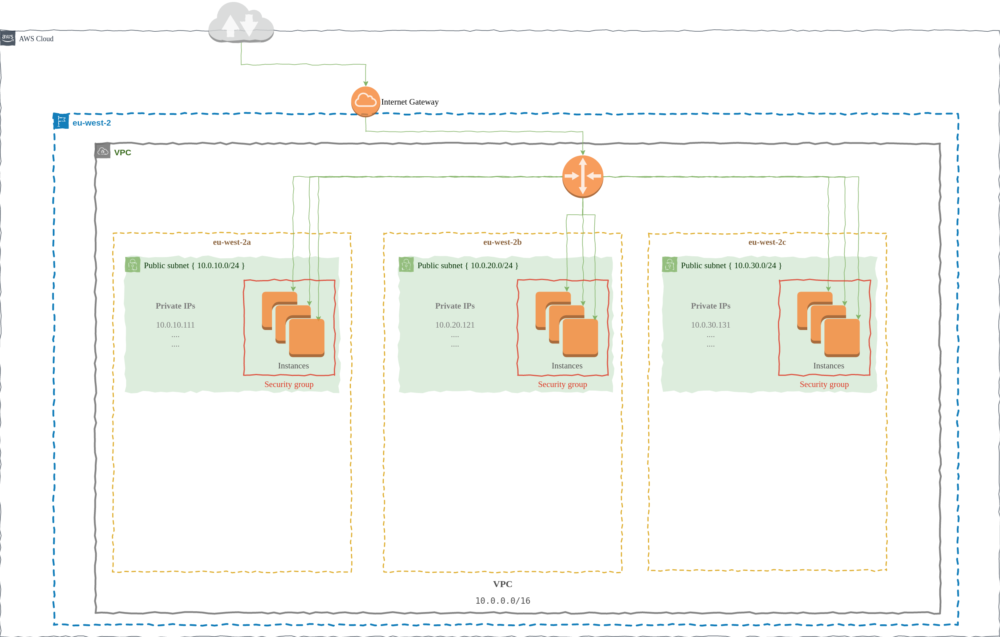

<!--
*** Thanks for checking out this project developed using terraform integrated with AWS Amazon. If you have a suggestion
*** that would make this better, please fork the repo and create a pull request
*** or simply open an issue with the tag "enhancement".
*** Don't forget to give the project a star!
*** Thanks again!
-->

## Building the VPC (Virtual Private Cloud) using Terraform on the AWS
Initialize the VPC (Virtual Private Cloud) on the AWS using Terraform.
 
 

<!-- ABOUT THE PROJECT -->
### About The Project
This project provide to create the VPC (Virtual Private Cloud) on AWS using Terraform.

 
 

### Used AWS Services and Features
* EC2
    - Instances
    - Security Group
    - Volumes
* VPC
    - Subnet
    - Route Tables
    - Internet Gateways
* EFS
    - AZ Specific EFS Mount

