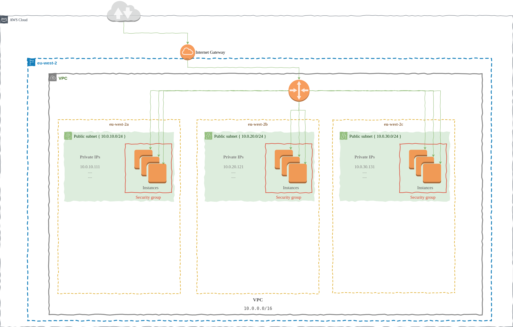

<div id="top"></div>
<!--
*** Thanks for checking out this project developed using terraform integrated with AWS Amazon. If you have a suggestion
*** that would make this better, please fork the repo and create a pull request
*** or simply open an issue with the tag "enhancement".
*** Don't forget to give the project a star!
*** Thanks again!
-->

<!-- INTRODUCTION -->
## Building the VPC (Virtual Private Cloud) using Terraform on the AWS
Initialize the VPC (Virtual Private Cloud) on the AWS using Terraform.
</br>
</br>

<!-- ABOUT THE PROJECT -->
## About The Project
This project provide to creation the VPC (Virtual Private Cloud) on AWS using Terraform. 

It's building;

* **Virtual Private Cloud**
    * A Virtual Private Cloud is created that your infrastructure will use

* **Elastic File System (EFS)**
    * Create a NFS file system for use with EC2 Instances
    * Create a mount target for each Availability Zone to use from EC2 Instances

* **Subnet**

* **Internet Gateway**

* **Security Group**
    * A Security Group is created to define and manage Inbound/Outbound access of servers as a virtual firewall
    * Ingress: 
        - Define the limited SSH access from the specific source IP address
        - Define the NFS access to mount Elastic File System storage
    * Egress:
        - Define All traffic access for Instances using this Security Group

* **Route Table**

* **EC2 Instance**



</br>
</br>

<!-- RUNNING -->
## Running
If you have [Terraform](https://www.terraform.io/) installed, you can run the
above example with the following commands.

1. Run the below command in a terminal, to initialize the provider plugins:
    ```console
    $ terraform init
    ```
2. Run the below command in a terminal, to check your configuration is valid:
    ```console
    $ terraform validate
    ```
3. Run the below command in a terminal to show changes required by the current configuration:
    ```console
    $ terraform plan
    ```
4. Run the below command in a terminal, to Create or Update infrastructure on the AWS:
    ```console
    $ terraform apply
    ```
4. Run the below command in a terminal, to Destroy previously-created infrastructure on the AWS:
    ```console
    $ terraform destroy
    ```

<br/>

### Downloading
You can download the Terraform from the [downloads page](https://www.terraform.io/downloads.html).
<br/>
<br/>


### Usage
```
Usage: terraform [global options] <subcommand> [args]

The available commands for execution are listed below.
The primary workflow commands are given first, followed by
less common or more advanced commands.

Main commands:
  init          Prepare your working directory for other commands
  validate      Check whether the configuration is valid
  plan          Show changes required by the current configuration
  apply         Create or update infrastructure
  destroy       Destroy previously-created infrastructure

All other commands:
  console       Try Terraform expressions at an interactive command prompt
  fmt           Reformat your configuration in the standard style
  force-unlock  Release a stuck lock on the current workspace
  get           Install or upgrade remote Terraform modules
  graph         Generate a Graphviz graph of the steps in an operation
  import        Associate existing infrastructure with a Terraform resource
  login         Obtain and save credentials for a remote host
  logout        Remove locally-stored credentials for a remote host
  output        Show output values from your root module
  providers     Show the providers required for this configuration
  refresh       Update the state to match remote systems
  show          Show the current state or a saved plan
  state         Advanced state management
  taint         Mark a resource instance as not fully functional
  test          Experimental support for module integration testing
  untaint       Remove the 'tainted' state from a resource instance
  version       Show the current Terraform version
  workspace     Workspace management

Global options (use these before the subcommand, if any):
  -chdir=DIR    Switch to a different working directory before executing the
                given subcommand.
  -help         Show this help output, or the help for a specified subcommand.
  -version      An alias for the "version" subcommand.
```

<br/>
<br/>


## Used AWS Services and Features
* EC2
    - Instances
    - Security Group
    - Volumes
* VPC
    - Subnet
    - Route Tables
    - Internet Gateways
* EFS
    - Elastic File System
